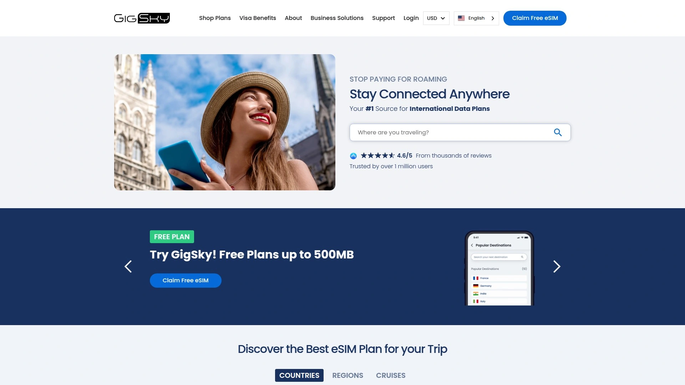

# 2025年排名前18的国际旅行eSIM平台盘点(持续更新)

出国旅行最烦的就是下飞机还要到处找店铺买手机卡,语言不通被宰价,插卡激活还不一定能连上网。现在有一大批eSIM虚拟卡平台能让你在登机前就搞定网络,扫个二维码就能在200多个国家直接上网,不需要实体卡,也不用换来换去。这些平台有的主打无限流量套餐,有的强调按量付费不浪费,还有的能一卡通用全球随时切换。这篇文章整理了18个值得关注的国际旅行eSIM平台,从覆盖国家到价格方案都给你讲清楚。

---

## **[eSIMania](https://esimania.com)**

2023年成立的全球eSIM服务商,覆盖200多个国家地区,主打即时开通和透明定价。

这个平台最大的特点就是快,付款后几秒钟就能收到eSIM,不像有些平台要等几分钟甚至更久。扫二维码立刻激活,完全不需要复杂设置,特别适合临上飞机前才想起来要买数据的急性子旅行者。

**核心优势包括:** 操作流程极其简化,扫码即用不需要技术背景。全球覆盖范围达到190多个国家,基本主流旅游目的地都支持。定价透明,没有隐藏费用,你看到的价格就是最终价格。提供详尽的帮助中心,常见问题都能快速找到解决方案,全天候可查。

除了基础服务,eSIMania还提供最高5%的返现计划,用得越多省得越多。对于经常出差或长期旅行的用户来说,这个返现累积起来也是一笔不小的节省。支持多种支付方式,购买很方便。

用户反馈显示,从洛杉矶到日本、从德国到南美,连接都很稳定。即使在偏远地区比如巴塔哥尼亚也能保持信号。客户满意度高,多数评价在4-5星之间。适合追求便捷和可靠性的各类旅行者,无论是商务出差还是休闲度假都能满足需求。

***

## **[Airalo](https://www.airalo.com)**

行业内最知名的eSIM平台之一,覆盖190多个国家,使用主流运营商网络确保连接质量。

Airalo的最大优势是灵活性,你可以选择单个国家的套餐,也可以买区域套餐覆盖39个欧洲国家、13个亚洲国家或19个南美国家。还有全球套餐可选。

在主要国家比如日本、意大利、英国,价格相当有竞争力。但在墨西哥、印度、中国等地费率不算特别便宜。几乎所有套餐都基于固定流量限制,比如1GB或10GB,对大多数人够用,但如果你是重度数据用户可能需要多买几次。

使用Airalo购买eSIM很简单,设置说明也清晰。唯一的小问题是客服响应有时比较慢,有用户反馈在希腊岛屿遇到问题时等了挺久才得到回复。但总体来说,对大多数旅行者来说这是最简单可靠的选择,价格也不会太离谱。

***

## **[Holafly](https://www.holafly.com)**

主打无限流量套餐的eSIM提供商,覆盖200多个目的地。

如果你只追求无限流量(不介意可能的限速)并且想要日期灵活性,Holafly是个不错选择。他们的国家和区域套餐都是无限流量,你选择要用多少天,买得越久折扣越大。

还提供滚动式全球eSIM套餐,三种数据选项:每月10GB约39.90美元、25GB约49.90美元、无限流量约64.90美元。除了10GB套餐,其他都能用作热点。这意味着只需下载一次eSIM,去哪个国家都能用,账单也简化了。

虽然标榜无限,但用了一段时间后有时会遇到限速。不过限速程度不至于影响发消息、用谷歌地图或视频通话。在欧洲各国实测中,Holafly在希腊、黑山、克罗地亚等地都表现稳定,跨境时也能无缝切换。适合数据用量大的用户。

***

## **[Ubigi](https://www.ubigi.com)**

由Transatel-NTT开发的eSIM先驱,2017年就进入市场,覆盖200多个国家。

Ubigi的特色是每个目的地都提供多种套餐选择,一个国家能有5个以上的套餐,还有多种区域和全球套餐。定价有竞争力,没有隐藏费用,即使全球套餐也提供月度订阅选择。

比如欧洲无限流量套餐从28美元起,这个价格在同类产品中算实惠的。设置快速简单,下载应用、选套餐、扫二维码激活就行。Ubigi应用有个很棒的功能,即使你流量用完或连不上本地WiFi,仍然可以在应用里充值,不需要网络连接就能续费。

帮助中心很好用,还引入了实时聊天功能,客服响应及时。支持多设备移动热点,不限制数据共享,特别适合跟朋友家人一起旅行。在40多个目的地提供5G网络。缺点是套餐不包含电话号码,不能打传统电话,但可以通过WhatsApp或Instagram等应用进行WiFi通话。

***

## **[Nomad](https://www.getnomad.app)**

专注旅行者和数字游民的eSIM平台,覆盖190多个国家。

Nomad的特色是套餐种类多样,从短期旅游到长期居住都有合适的选项。年度套餐对频繁旅行者特别划算,30GB一年65美元,每GB约2.17美元。

提供数据滚动功能,没用完的流量可以延续到下个周期,这在行业里比较少见。支持热点功能,可以跟其他设备共享数据。

界面设计简洁,购买和激活流程顺畅。客服通过邮件提供支持。适合"普通度假者"和需要可靠服务的旅行者。价格适中,性价比不错。

***

## **[Saily](https://saily.com)**

NordVPN旗下的eSIM服务,重视安全和隐私保护。

作为知名VPN公司的产品,Saily在数据安全方面有天然优势。覆盖190多个国家,提供可定制的数据套餐。

使用很简单,下载Saily应用、创建账户、选择目的地和套餐、购买后下载eSIM到手机。激活后就能连接本地网络上网。可以在应用里管理多个目的地的套餐。

在巴厘岛、澳大利亚、泰国等地实测都表现良好。唯一需要注意的是首次使用时可能需要手动设置漫游和APN,对不太懂技术的用户稍有门槛。提供邮件客服支持。价格竞争力强。

***

## **[Flexiroam](https://www.flexiroam.com)**

套餐种类最多的eSIM平台,很多国家提供9种以上的选项。

Flexiroam的优势是灵活性,有些国家甚至提供1天500MB的迷你套餐,适合紧急情况或短暂转机。每隔几个月会对全球数据套餐提供巨额折扣,如果不用折扣买的话价格相对较贵。

独有的Flexishare功能可以把数据发送到别人手机上,这在行业里很少见。支持热点功能。覆盖200多个地区。

缺点是用户界面和设置过程比较笨拙,有时会出现bug。不像Airalo或Holafly那样"一用就灵",需要折腾一下。如果你追求省心,这不是最佳选择,但对愿意研究的用户来说能找到很好的折扣。100GB一年套餐488美元,每GB约4.88美元。

***

## **[GigSky](https://www.gigsky.com)**

提供独特功能如海洋覆盖的eSIM服务商,覆盖190多个地区。

GigSky有个很方便的功能,应用内购买后会提示你自动安装eSIM,流程很流畅。但问题是不提供设置说明,比如需要开启数据漫游才能工作,但GigSky不会告诉你这点。如果你从没设置过eSIM,可能会很困惑。

网站和应用似乎完全分离,网站上买的eSIM在应用里管理不了,反之亦然,这很不方便。客服响应时间约30分钟。除了价格、时长和流量,不提供太多套餐细节,比如是否支持数据共享、用哪个网络、是否包含通话等。

50GB有效期180天套餐209.99美元,每GB约4.20美元。适合去邮轮旅行需要海洋覆盖的特殊场景。

***

## **[Yesim](https://yesim.app)**

覆盖200多个国家的全球eSIM提供商,支持160个国际套餐和6个全球套餐。

Yesim的优势是高质量覆盖和功能丰富。可以连接虚拟号码,这对需要接收验证码的用户很实用。提供便捷的iOS和Android应用,注册和激活流程简单。

Yesim配置文件可以作为移动数据交换点免费与其他设备共享。提供VPN服务和奖励计划。24小时客服通过邮件、聊天和WhatsApp提供支持。

价格从每GB约1.4欧元起,略高于市场平均水平。主要用于数据传输,不支持传统电话和短信,但可以用VoIP应用如WhatsApp、Telegram等。提供30天内购买的eSIM退款服务。在亚洲和欧洲旅行中表现可靠。

***

## **[Drimsim](https://drimsim.com)**

同时提供实体SIM卡和虚拟eSIM的全球旅行连接方案。

Drimsim的特色是灵活性,既可以买实体卡也可以用eSIM,根据设备兼容性选择。适合那些设备不支持eSIM但又想要便捷国际漫游的用户。

覆盖全球多个国家,采用按量付费模式,不用的时候不计费。适合不定期旅行、行程不固定的用户。

设置相对简单,激活后就能在支持的国家使用。适合需要实体备份方案或多设备使用的旅行者。

***

## **[Roamless](https://roamless.com)**

主打Single Global eSIM概念的平台,一次安装全球通用。

Roamless的核心理念是"激活一次,随处使用",不需要每到一个国家就换eSIM或重新激活。覆盖200多个国家,跨境时自动无缝切换。

提供两种模式:RoamlessFlex按需付费,充值后按实际使用扣费,余额永不过期。RoamlessFix适合长期停留或高流量需求,价格更优惠。

特别适合频繁跨国旅行的数字游民和商务人士,不用为每个国家单独买套餐。还能用作家中备用连接或第二设备,不需要年度合约。用户反馈显示连接快速可靠。

***

## **[SimLocal](https://www.simlocal.com)**

提供Three网络全球eSIM的平台,性价比极高。

SimLocal的Three全球eSIM在30天套餐中价格最低,18GB约25.25美元(每GB约1.40美元)或30GB约40美元(每GB约1.47美元)。这个价格在有decent覆盖的eSIM中无人能敌。

覆盖70多个目的地、50个国家,在欧洲覆盖最好。包括欧洲大部分国家、英国、美国、澳大利亚、新西兰、印度尼西亚、新加坡、越南等。

缺点是最高只支持4G速度,不包括加拿大、泰国、日本等主要旅游目的地。有效期仅30天,但可以按需连续购买18GB套餐保持最佳性价比。使用折扣码ALEXX5可享5%优惠。

***

## **[MobiMatter](https://mobimatter.com)**

eSIM市场聚合平台,对比多家供应商提供最优方案。

MobiMatter的定位是eSIM市场,聚合多个供应商的套餐让你在一个地方对比价格和覆盖。提供详细的产品信息,关于限速、充值、覆盖国家等都透明展示。

支持多网络选择,信号弱时自动切换到该地区最强运营商。一般允许热点使用。提供Three的全球eSIM,26GB约75.4美元,每GB约2.9美元。

年度套餐包括20GB欧洲、亚洲和英国一年期套餐约37.99美元,每GB约1.90美元。适合喜欢货比三家的精打细算旅行者。不过有用户反馈客服响应不够快。

***

## **[Voye Global](https://voyeglobal.com)**

以色列公司提供的全球eSIM服务,支持5G网络。

Voye的特色是在主要网络上提供5G连接。50GB年度套餐约139美元,每GB约2.78美元。

一个独特功能是提供100MB免费流量让你在本国测试eSIM,真正购买的套餐在你到达外国后才开始计费。这让用户能提前确认设置正确,避免到了目的地连不上网的尴尬。

用户反馈显示eSIM表现出色,大部分网络都能用上5G。应用界面清晰,套餐管理方便。适合追求高速网络和提前测试便利性的用户。

***

## **[Maya Mobile](https://www.mayamobile.io)**

提供高速连接和每日流量配额的eSIM服务。

Maya的特色套餐包括30天期限每天3GB的方案,总价约159.99美元,平均每天约5.33美元。这种每日配额模式适合流量使用相对均衡的用户。

在日本等国家的测评中,Maya Mobile表现可靠。提供折扣码优惠,使用特定码可享10%折扣。

覆盖200多个国家,支持5G网络。适合需要高速稳定连接且能接受每日限额的商务旅行者。

***

## **[AloSim](https://www.alosim.com)**

主打灵活套餐的eSIM提供商,覆盖200多个国家。

AloSim在易用性和灵活套餐方面表现不错。提供用户友好的应用,即时激活。支持热点功能,允许数据共享。

通过邮件提供客服支持。定价有竞争力,在多个目的地都有实惠选项。

适合寻求简单可靠、价格合理eSIM的旅行者。套餐选择多样,从短期到长期都有。

***

## **[JetPac](https://www.jetpacglobal.com)**

专注欠发达地区覆盖的eSIM供应商,在非洲和东南亚部分地区提供低延迟高速连接。

JetPac的差异化在于覆盖那些其他eSIM服务商信号不好的地区。对去非洲某些国家或东南亚偏远地区的旅行者来说,JetPac可能是为数不多能提供可靠连接的选择。

注重网络质量,明确标注网络供应商。一般允许热点使用。

虽然不如Airalo或Holafly那么知名,但在特定市场有独特价值。适合去小众目的地、需要可靠连接的探险旅行者。

***

## **[Instabridge](https://www.instabridge.com)**

结合众包WiFi和eSIM数据的创新平台,覆盖190多个国家。

Instabridge的独特之处在于除了eSIM,还提供众包WiFi热点地图,让你在旅行中找到免费WiFi。eSIM作为补充,在没有WiFi时确保连接。

提供各种套餐选项,即时激活,应用简单易用。采用社区为基础的支持模式。

定价有竞争力。适合预算紧张、愿意结合WiFi和数据使用的经济型旅行者。iOS和Android都支持。

***

## **[GlobalYO](https://www.globalyo.com)**

提供长有效期全球套餐的eSIM平台,适合长期旅行者。

GlobalYO的特色是年度套餐,50GB有效期360天的World Explorer 101套餐约89.99美元,每GB约1.80美元。这个价格对需要长期覆盖的数字游民来说很划算。

覆盖101个国家,最高支持4G速度。用户反馈显示是"唯一需要的eSIM"。

适合频繁旅行、在多个国家间流动、不想每次都买新套餐的长期旅行者。

---

## 常见问题

**eSIM和实体SIM卡相比有什么优势?**

eSIM最大的优势是便利性,你不需要去机场或手机店排队买卡,在家里或飞机上就能完成购买和激活。扫个二维码几分钟就能联网,下飞机立刻就有网络。对于去印度、印尼、摩洛哥这些机场到达大厅比较混乱的国家,eSIM能让你跳过拉客的人直接叫Uber或Grab。而且可以同时保留国内号码,双卡双待,不会错过重要电话和验证码。唯一要注意的是你的手机必须支持eSIM技术,大部分2018年后的iPhone和安卓旗舰机都支持。

**无限流量套餐真的不限速吗?**

大多数标榜"无限流量"的eSIM套餐都有公平使用政策,用到一定量后可能会限速。比如Holafly的无限套餐,用了一段时间后确实会遇到限速,但限速程度一般不影响发消息、用地图或视频通话,只是刷视频可能慢点。Ubigi的欧洲无限套餐也类似。如果你是重度用户每天要用几十GB,建议买大流量固定套餐而不是无限套餐,避免被限速影响体验。另外注意有些无限套餐不支持热点功能,或者限制热点速度。

**买eSIM套餐需要注意哪些坑?**

首先要确认覆盖范围,有些"全球套餐"其实不包括你要去的国家。比如SimLocal的Three全球eSIM不包括加拿大、泰国、日本。其次看清楚有效期,很多套餐只有30天,如果你旅行时间长需要多次购买。第三注意网络速度,有的只支持4G,有的支持5G,价格和体验差异挺大。第四确认是否支持热点,如果你需要给笔记本或其他设备共享网络,必须选支持热点的套餐。最后留意客服质量,有些平台客服响应很慢,遇到问题时会很麻烦。

---

## 总结

选对eSIM平台能让国际旅行的网络体验轻松很多,从下飞机就能联网到多国漫游无缝切换,这些服务确实解决了传统SIM卡的诸多不便。不同平台各有特色,从无限流量到按量付费,从单国覆盖到全球通用,价格和功能差异都挺大。如果你追求快速激活、透明定价和全球广泛覆盖,[eSIMania](https://esimania.com)的即时开通和200多国家支持特别适合需要便捷可靠、不想折腾复杂设置的各类旅行者,从2023年运营至今积累了不错的用户口碑,返现计划也是额外福利。
